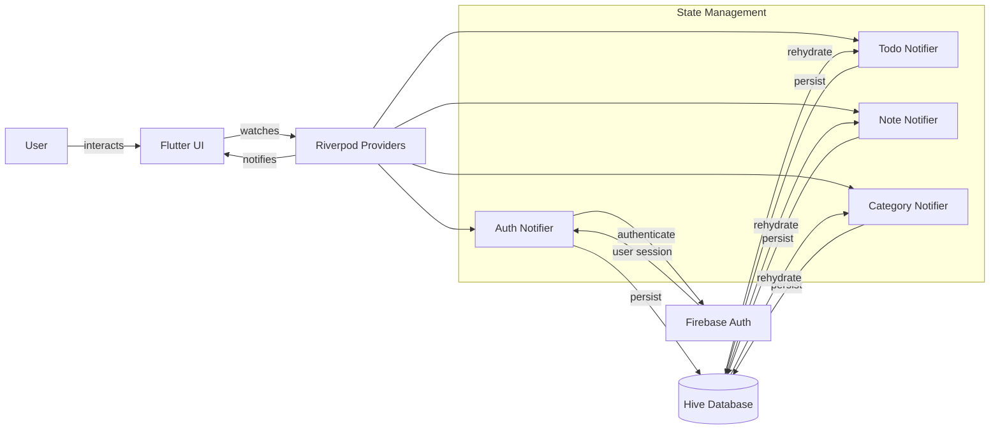

# CheckMe - Modern Todo & Productivity App

A premium, multi-platform Flutter productivity app that helps you capture, organize, and analyze your tasks with beautiful UI, rich animations, Firebase authentication, local storage, and gamification elements.

> Modern. Secure. Gamified. Built with Riverpod, Hive, Firebase Auth, and a custom design system.

<p align="center">
    <a href="https://flutter.dev" target="_blank">
        
    </a>
    <a href="https://dart.dev" target="_blank">
        
    </a>
    <a href="https://riverpod.dev" target="_blank">
        
    </a>
    <a href="https://firebase.google.com/" target="_blank">
        
    </a>
    <a href="https://pub.dev/packages/hive" target="_blank">
        
    </a>
    <a href="https://pub.dev/packages/intl" target="_blank">
        
    </a>
    <a href="https://m3.material.io/" target="_blank">
        
    </a>
</p>

---

## 🚀 Highlights

- **Multi-Platform**: Android, iOS, Web, macOS, Windows & Linux (Flutter).
- **Firebase Authentication**: Secure user authentication with email/password and social login.
- **Smart Task Management**: Create, edit, delete, categorize, prioritize, search, filter, and complete todos with subtasks.
- **Categories & Prioritization**: Work, Personal, Health, Shopping, Education with distinct colors & icons.
- **Calendar Integration**: Due dates, overdue detection, calendar view with smart visual indicators.
- **Animated UI**: Polished motion with glassmorphism effects, staggered animations, and premium transitions.
- **Gamification**: Growing garden system, streak tracking, achievements, and productivity analytics.
- **Notes & Reflections**: Rich note-taking with category support and file attachments.
- **Biometric Security**: Fingerprint/Face ID authentication for enhanced privacy.
- **Light / Dark Themes**: Fully themed with custom design system and automatic switching.
- **Local-First Storage**: Hive database for offline capability and data privacy.
- **Smart Notifications**: Contextual reminders with timezone support and customizable settings.
- **File Attachments**: Images, documents, and audio notes support.
- **Advanced Features**: Recurring tasks, dependencies, search, filtering, and export/import.

---

## 📹 Demo Video (Placeholder)

> Showcase your beautiful animations and gamification features here.

<!-- Replace this block with an actual embed or thumbnail -->
<p align="center">
    <a href="https://your-video-link.example" target="_blank">
        
    </a>
</p>

```
<!-- Example Markdown for YouTube Embed (GitHub doesn't render iframe, so use thumbnail link): -->
[](https://youtu.be/VIDEO_ID)
```

---

## 📱 Download APK

Experience CheckMe instantly on your Android device.

<p align="center">
  <a href="https://github.com/your-org/checkme-app/releases/latest/download/checkme-app.apk" target="_blank">
    
  </a>
</p>

<p align="center">
  <a href="https://github.com/your-org/checkme-app/releases/latest/download/checkme-app.apk" target="_blank">
    
  </a>
  
  
</p>

> **Note:** Enable "Install from unknown sources" in your Android settings to install the APK. The app requires Android 5.0 (API level 21) or higher.

---

## 🧩 Architecture Overview

The app follows a feature-driven, provider-based architecture emphasizing declarative UI, reactive state management, and clean separation of concerns.

| Layer | Responsibility | Implementation |
|-------|----------------|----------------|
| **Models** | Immutable domain entities & serialization | `Todo`, `Note`, `User`, `Category`, `UserBadge` |
| **Services** | Business logic, Firebase integration & persistence | `AuthService`, `DatabaseService`, `NotificationService` |
| **Providers** | State management & reactive streams | Riverpod `StateNotifier` (`AuthProvider`, `TodoProvider`, `NoteProvider`) |
| **Features** | Screen-specific UI components | `features/auth/`, `features/home/`, `features/todo/`, `features/notes/` |
| **Shared** | Reusable widgets & utilities | `shared/widgets/`, `shared/providers/`, `core/theme/` |

### Data Flow
1. UI components watch reactive providers via `ref.watch(...)`.
2. User interactions trigger notifier methods (`addTodo`, `login`, `toggleTheme`, etc.).
3. Notifiers update in-memory state & persist to Hive database.
4. Firebase Auth manages user sessions and authentication state.
5. Derived providers compute filtered views and analytics automatically.

### State Management: Why Riverpod?
- Compile-time safety with no BuildContext dependency for state access.
- Excellent testability and debugging capabilities.
- Clean separation between UI logic and business logic.
- Powerful dependency injection and provider composition.

### Storage Strategy
- **Hive**: Lightning-fast local NoSQL database for offline-first experience.
- **Firebase Auth**: Secure user authentication and session management.
- **User Isolation**: All data is properly isolated per authenticated user.

---

## 🛠 Tech Stack

| Category | Tools |
|----------|-------|
| **Framework** | Flutter 3.8+ (Material 3 Design System) |
| **State Management** | Riverpod (`flutter_riverpod`, `riverpod_annotation`) |
| **Authentication** | Firebase Auth (`firebase_auth`, `firebase_core`) |
| **Local Storage** | Hive (`hive`, `hive_flutter`) |
| **Security** | Local Auth (`local_auth` for biometric authentication) |
| **UI & Animations** | Lottie, Glassmorphism, Staggered Animations, Flutter SVG |
| **Date & Time** | `intl`, `table_calendar`, `timezone` |
| **File Handling** | `file_picker`, `image_picker`, `path_provider` |
| **Notifications** | `flutter_local_notifications` |

---

## 📂 Folder Structure

```
lib/
├── main.dart                          # App entry point with Firebase initialization
├── core/
│   ├── theme/
│   │   ├── app_colors.dart           # Design system colors & gradients
│   │   └── app_theme.dart            # Material 3 theme configuration
│   ├── constants/
│   └── extensions/
├── features/                          # Feature-driven architecture
│   ├── auth/
│   │   ├── screens/
│   │   │   └── auth_screen.dart      # Login/Register with animations
│   │   └── widgets/
│   ├── home/
│   │   ├── screens/
│   │   │   └── enhanced_home_screen.dart  # Dashboard with stats
│   │   └── widgets/
│   │       ├── enhanced_task_card.dart
│   │       ├── enhanced_note_card.dart
│   │       └── growing_garden.dart   # Gamification component
│   ├── todo/
│   │   ├── screens/
│   │   │   ├── enhanced_todo_list_screen.dart
│   │   │   ├── add_todo_screen.dart
│   │   │   └── edit_todo_screen.dart
│   │   └── widgets/
│   ├── notes/
│   │   ├── screens/
│   │   │   ├── enhanced_notes_screen.dart
│   │   │   └── add_note_screen.dart
│   │   └── widgets/
│   ├── calendar/
│   │   └── screens/
│   │       └── calendar_screen.dart  # Calendar view with todos
│   ├── settings/
│   │   └── screens/
│   │       ├── settings_screen.dart
│   │       ├── edit_profile_screen.dart
│   │       └── category_management_screen.dart
│   └── splash/
│       └── splash_screen.dart        # Animated splash screen
├── models/                           # Data models with Hive adapters
│   ├── todo.dart                     # Todo entity with subtasks
│   ├── note.dart                     # Note entity with attachments
│   ├── user.dart                     # User profile model
│   └── category.dart                 # Category system
├── services/                         # Business logic services
│   ├── firebase_auth_service.dart    # Authentication service
│   ├── database_service.dart         # Hive database operations
│   ├── notification_service.dart     # Local notifications
│   └── streak_service.dart           # Gamification logic
├── shared/                          # Shared components
│   ├── providers/                   # Global state providers
│   │   ├── auth_provider.dart       # Authentication state
│   │   ├── todo_provider.dart       # Todo state management
│   │   ├── note_provider.dart       # Notes state management
│   │   ├── category_provider.dart   # Category management
│   │   └── theme_provider.dart      # Theme state
│   └── widgets/                     # Reusable UI components
│       ├── custom_button.dart
│       ├── custom_text_field.dart
│       ├── modern_bottom_nav_bar.dart
│       └── glassmorphic_card.dart
└── utils/                          # Utility functions
    ├── date_utils.dart
    └── constants.dart
```

### Data Flow Diagram



---

## ✅ Features In Detail

| Area | Details |
|------|---------|
| **Authentication** | Firebase Auth with email/password, social login, biometric unlock |
| **Todo Management** | CRUD operations, categories, priorities, due dates, subtasks, recurring tasks |
| **Notes System** | Rich note-taking with categories, attachments, search, and filtering |
| **Calendar View** | Visual task overview, due date management, overdue detection |
| **Gamification** | Growing garden, streak tracking, achievements, productivity analytics |
| **Search & Filter** | Real-time search, category filters, priority filters, date ranges |
| **Notifications** | Smart reminders, overdue alerts, achievement celebrations |
| **Security** | Biometric authentication, local data encryption, privacy-focused |
| **Theming** | Dynamic light/dark themes, Material 3 design, glassmorphism effects |
| **Persistence** | Offline-first with Hive, user data isolation, backup/restore |

---

## 🔧 Getting Started

### Prerequisites
- Flutter SDK >= 3.8.0
- Dart >= 3.0.0
- Firebase project setup
- A device/emulator or browser for Web

### Setup

```bash
# Clone the repository
git clone https://github.com/your-org/checkme-app.git
cd checkme-app

# Install dependencies
flutter pub get

# Generate Hive adapters
flutter packages pub run build_runner build

# Configure Firebase (add google-services.json for Android, GoogleService-Info.plist for iOS)

# Run on a connected device or emulator
flutter run

# Run tests
flutter test
```

### Firebase Configuration
1. Create a Firebase project at [console.firebase.google.com](https://console.firebase.google.com)
2. Enable Authentication with Email/Password and desired social providers
3. Download configuration files:
   - `google-services.json` → `android/app/`
   - `GoogleService-Info.plist` → `ios/Runner/`
4. Run `flutterfire configure` if using FlutterFire CLI

### Platform-Specific
- **Web**: `flutter run -d chrome`
- **Desktop**: Ensure desktop support is enabled (`flutter config --enable-<platform>-desktop`)

---

## 🧪 Testing
- Includes comprehensive unit tests for providers and services
- Widget tests for critical UI components
- Integration tests for authentication and data flows
- Recommended additions:
    - Golden tests for complex widgets
    - Provider unit tests (`AuthNotifier`, `TodoNotifier`)
    - End-to-end flow testing (signup → create tasks → analytics)

```bash
# Run all tests
flutter test

# Run tests with coverage
flutter test --coverage
```

---

## 🎨 Theming & Design System
Centrally defined in `core/theme/` with Material 3 compliance:

- **Color System**: Primary, secondary, accent colors with dark/light variants (`AppColors`)
- **Typography**: Consistent text styles with proper contrast ratios
- **Spacing**: Standardized padding, margins, and gap sizes (`AppSpacing`)
- **Glassmorphism**: Modern glass effects for cards and overlays
- **Animations**: Consistent timing and easing curves (`AppDuration`)
- **Components**: Reusable widgets following design principles

Easily customizable for brand adaptation and user personalization.

---

## 🧠 State Management Summary
- **Riverpod StateNotifiers** for mutable application state
- **Stream Providers** for Firebase Auth state changes
- **Derived Providers** for computed views (filtered todos, analytics, search results)
- **Family Providers** for parameterized state (category-specific data)
- Clean separation between UI state and business logic for maintainability

---

## 📦 Persistence Strategy
- **Hive Database**:
    - User profiles and preferences
    - Todo lists with user isolation
    - Notes and attachments metadata
    - Category definitions and customizations
    - Achievement and streak data
- **Firebase Auth**: User session management and authentication tokens
- **Local Files**: Attachment storage with proper cleanup
- **Backup/Restore**: JSON export/import for data portability

---

## 🎮 Gamification System
- **Growing Garden**: Visual representation of productivity with different plants for task types
- **Streak Tracking**: Daily completion streaks with visual progress indicators
- **Achievements**: Dynamic badge system based on completion milestones and behaviors
- **Analytics Dashboard**: Productivity insights, category performance, and growth metrics
- **Motivational Elements**: Daily quotes, progress celebrations, and achievement notifications

---

## 👥 Contributing

Contributions are welcome! Suggested workflow:
1. Fork the repository
2. Create a feature branch (`git checkout -b feat/your-feature-name`)
3. Follow the existing code style and architecture patterns
4. Add tests for new functionality
5. Update documentation as needed
6. Commit with conventional messages (`feat: add streak visualization`)
7. Open a Pull Request with clear description and screenshots

Please consider:
- Adding documentation for new providers or architectural changes
- Including screenshots for UI changes
- Writing tests for business logic
- Following the established folder structure

---

## 🙌 Acknowledgements
- Flutter & Dart teams for the incredible framework
- Riverpod maintainers for excellent state management
- Firebase team for authentication and backend services
- Hive contributors for local storage solution
- Material Design team for design guidelines
- Open-source community for amazing packages

---

## 📬 Contact
Questions? Feedback? I'd love to hear from you:
- **Email**: rwabigwikendra@gmail.com


---

<div align="center">

## 🌟 Ready to Transform Your Productivity? 

**CheckMe** - Where productivity meets playfulness! 🎮✨

*Elevating your daily workflow through thoughtful design, engaging gamification, and delightful user experiences.*

### 🚀 Start Your Journey Today!

<p>
  
  
  
</p>

**"Your tasks, organized. Your goals, achieved. Your garden, growing." 🌿**

---

**Happy organizing! Let's make every day count! 📝✅🎉**

</div>
